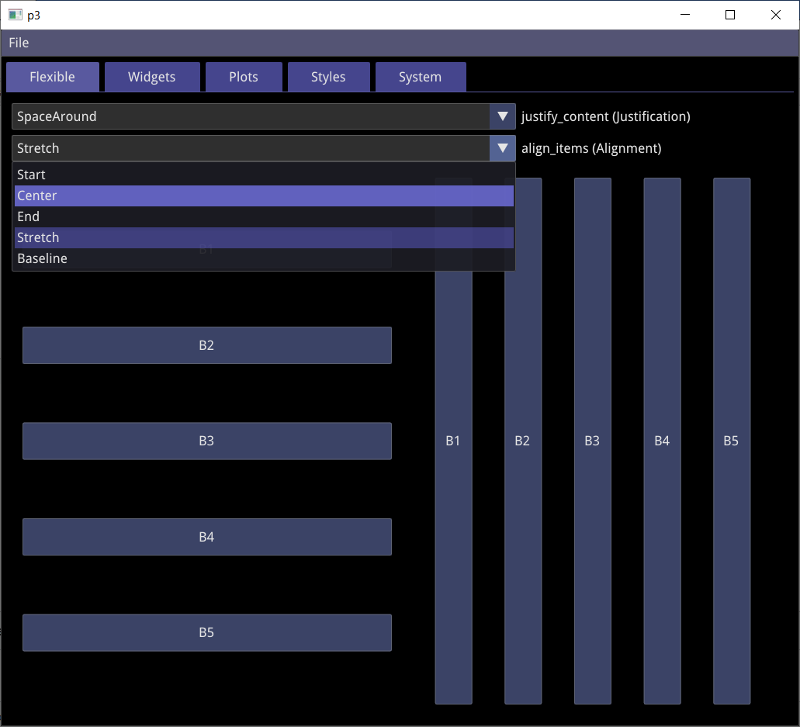
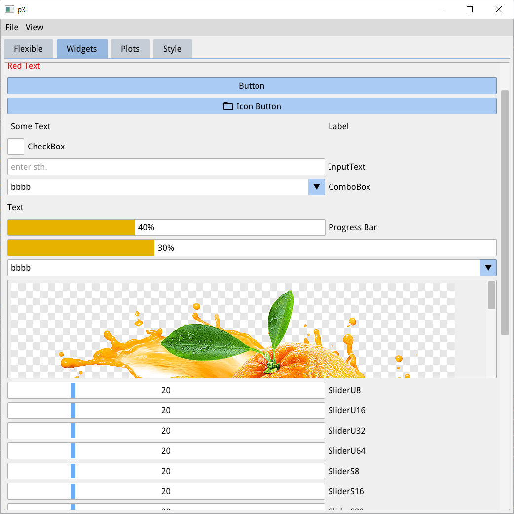
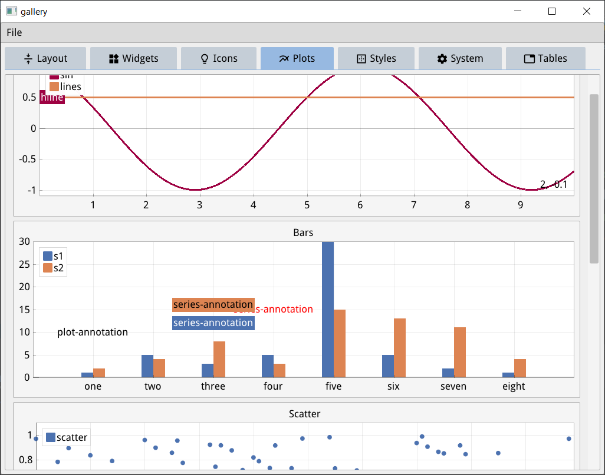
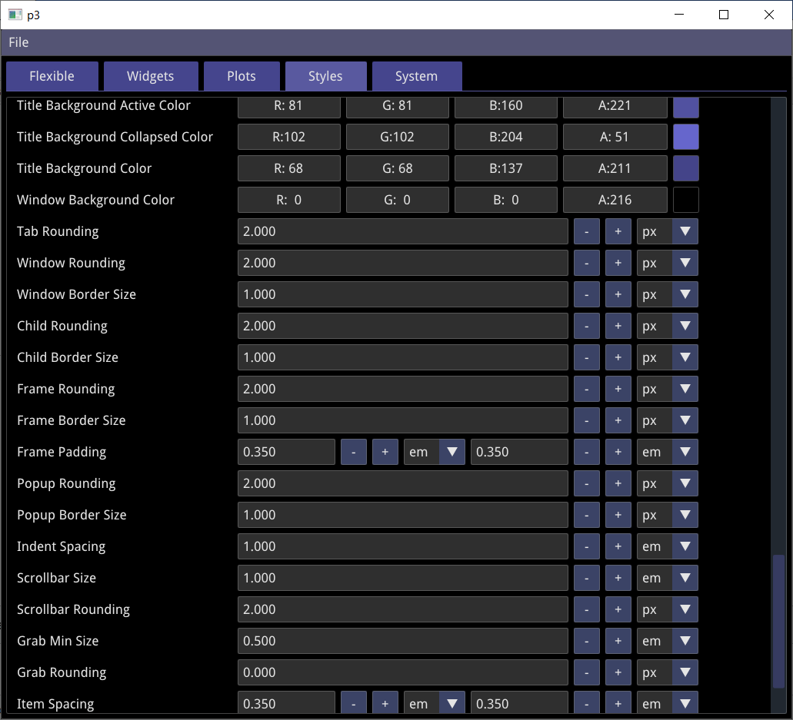
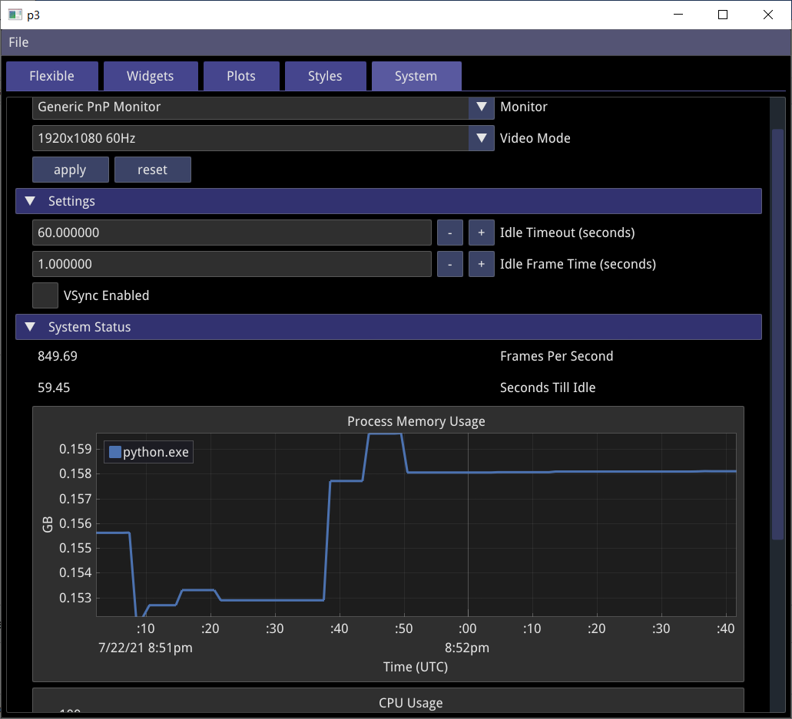

# C++, Python User Interface Library

This project aims at fast prototyping and development of performant applications in C++ or Python. It uses and combines [Dear ImGui](https://github.com/ocornut/imgui) and related projects like [ImPlot](https://github.com/epezent/implot) in an object-oriented wrapper written in C++, which is also usable within Python via [Pybind11](https://github.com/pybind/pybind11).

#  Example

Sourcecode for the example is [provided here](python/gallery)

